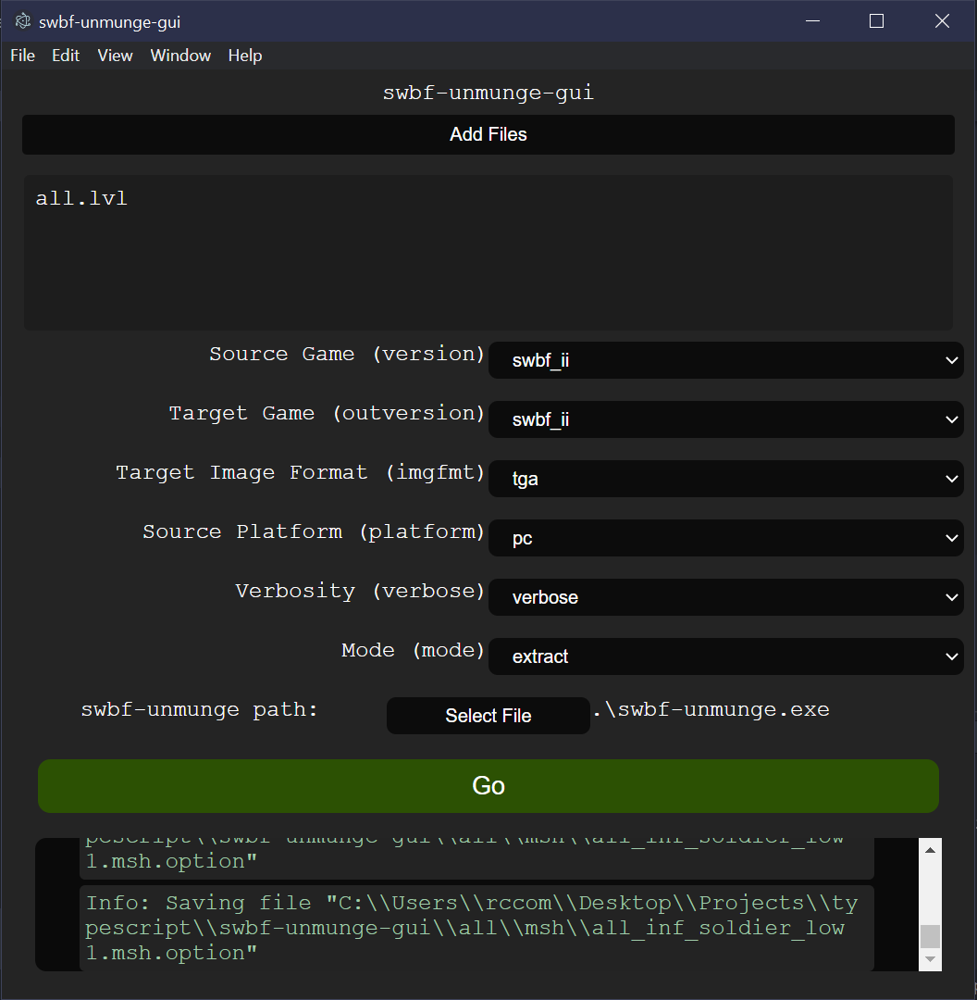

# swbf-unmunge-gui
A graphics interface for [sleepkiller/swbf-unmunge](https://github.com/SleepKiller/swbf-unmunge) cli tool
 
Written in TypeScript

## Status
Started - not functional

## Usage
### Install
### Running
### Screenshots

## Meta
Frameworks Used:
- Electron (GUI framework)
- Nodejs (OS APIs like filesystem)

Libraries Used:
- [exponent-ts](https://github.com/RepComm/exponent-ts) (my own UI library)

## Links I found useful
[SO - electron - using preload.js properly](https://stackoverflow.com/questions/57807459/how-to-use-preload-js-properly-in-electron)